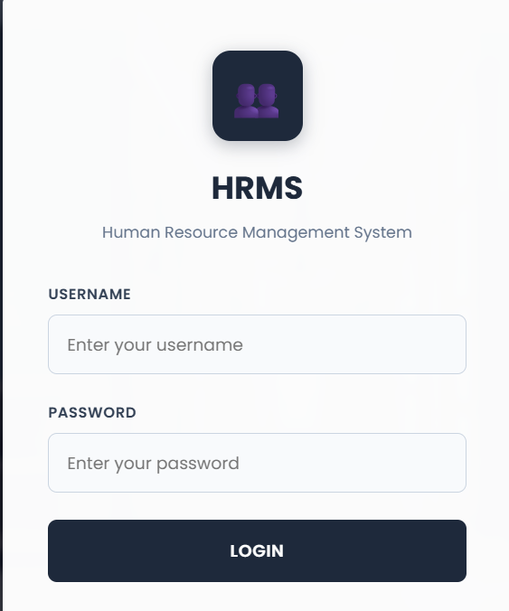
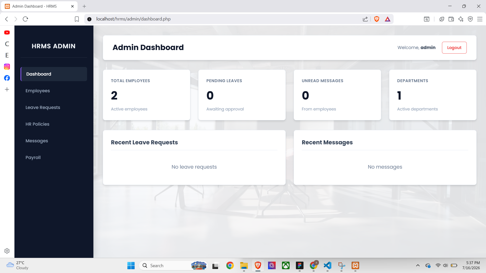
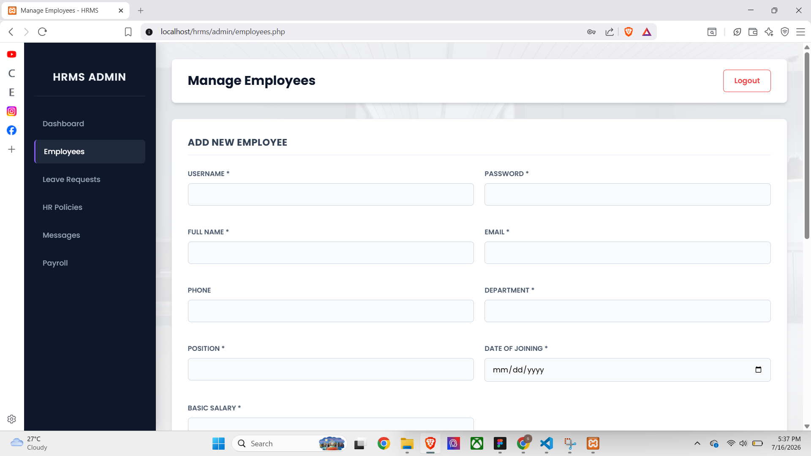
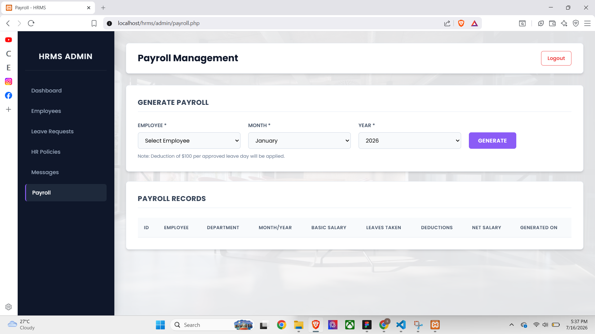
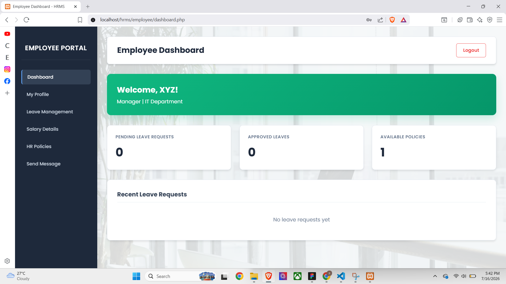

# 🏢 Smart Employee & HR Management System (HRMS)


A web-based Human Resource Management System (HRMS) developed using **PHP** and **MySQL** to simplify employee management, attendance tracking, leave requests, payroll, and other HR operations.

---

# 📖 Project Overview

The Smart Employee & HR Management System is designed to automate and simplify daily HR activities. It enables administrators to efficiently manage employees, attendance, leave requests, payroll, and departments through an easy-to-use web interface.

This project was developed as part of my academic learning to strengthen my skills in PHP, MySQL, frontend development, and database management.

---

# ✨ Features

- 🔐 Secure Admin Login
- 👥 Employee Management
- 🏢 Department Management
- 📝 Leave Management
- 💰 Payroll Management
- 📅 Attendance Tracking
- 📢 Announcement Management
- 📊 Dashboard with Statistics
- 🔍 Search & Filter Employees
- 👨‍💼 Admin Panel
- 📱 Responsive User Interface

---

# 🛠️ Tech Stack

| Technology | Purpose |
|------------|----------|
| PHP | Backend Development |
| MySQL | Database |
| HTML5 | Structure |
| CSS3 | Styling |
| JavaScript | Client-side Functionality |
| Bootstrap | Responsive Design |
| XAMPP | Local Development Server |

---

# 📂 Folder Structure

```text
HRMS
│
├── admin/
├── employee/
├── assets/
├── config/
├── database/
├── includes/
├── css/
├── js/
├── index.php
├── login.php
└── README.md
```

---

# 🚀 Installation

1. Install **XAMPP**.
2. Copy the project folder into:

```text
C:\xampp\htdocs\hrms
```

3. Start **Apache** and **MySQL**.

4. Open phpMyAdmin.

5. Create a database.

6. Import the SQL file included with the project.

7. Open your browser and visit:

```text
http://localhost/hrms/
```

---

# 📸 Screenshots

## 🔐 Login Page



---

## 📊 Dashboard



---

## 👥 Employee Management



---

## 💰 Payroll Management



---

## 👨‍💼 Employee Portal



# 🎯 Learning Outcomes

Through this project, I gained practical experience in:

- PHP Programming
- CRUD Operations
- MySQL Database Design
- Session Management
- User Authentication
- Responsive Web Design
- Database Connectivity
- HR Workflow Automation

---

# 🔮 Future Enhancements

- Email Notifications
- Employee Performance Evaluation
- Recruitment Module
- Export Reports (PDF & Excel)
- Dark Mode
- Mobile Optimization

---

# 👩‍💻 Developer

**Shraddha Koirala**

Bachelor of Information Management (BIM)

Tribhuvan University

GitHub: https://github.com/ShraddhaKoirala

---

⭐ If you found this project interesting, please consider giving it a star!